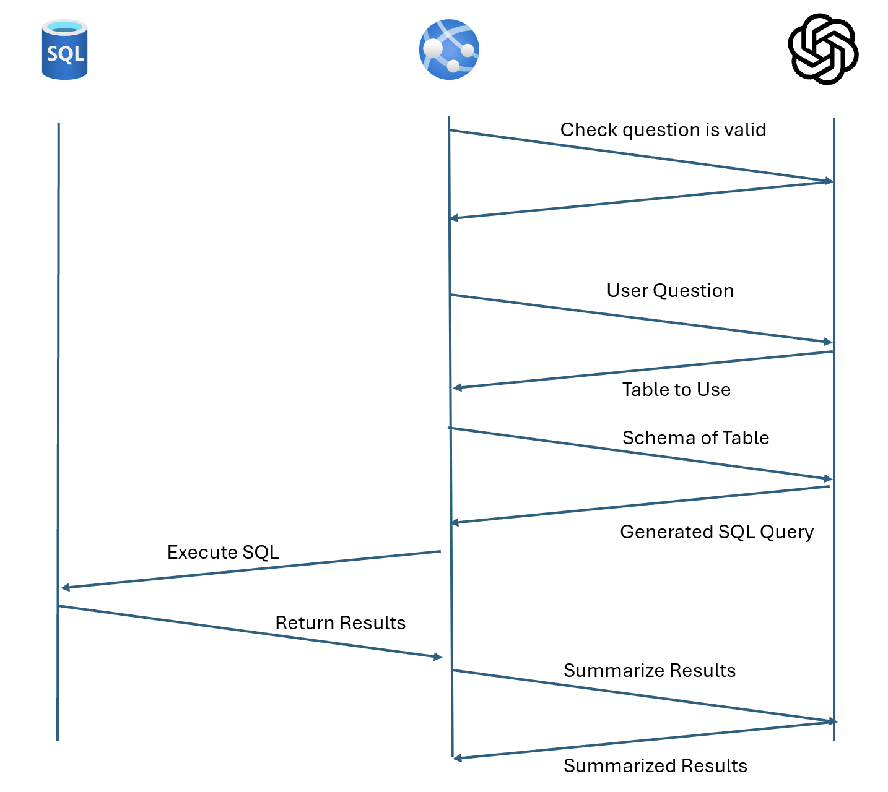

# Database Copilot


This example repo demonstrates the capabilities of Azure Open AI to efficiently and easily query a database
through a web chat-bot-like interface. 

This repo consists of two projects

1) A web front end for displaying the chat interface. 
2) A web API that is responsible for orchestrating the calling of the Open AI model(s) and querying the database for results. 

## Orchestration

In this solution, the API application is orchestrating the connection to Open AI and to the SQL server.  The API application is responsible for sending data to Open AI and processing the response in a standard way. 

Below is a diagram referencing the flow of this data: 




## Debugging
To run the project, we need to start the API and then start the front end web interface. 

In one terminal: 
```bash
cd DatabaseChatBot.Api
dotnet restore
dotnet build
dotnet bin/Debug/7.0/DatabaseChatBot.Api.dll
```

In another terminal:
```bash
cd dbchat.web
npm install 
npm build
```

## Building For Production

To build the project, follow these steps:

```bash
cd DatabseChatBot.Api
dotnet publish
cd ../dbchat.web
npm install
npm run build
```

## Required AppSettings - API
An appsettings.json file is required for the API Application. This is not included in the repo.  
Use the following template to create the app settings. 
```json
"ConnectionStrings": {
    "SqlConnectionString": "SqlConnectionString"
  },

  "TableDescriptionsUrl": "Path/To/Local/File/For/TableDescription.json",

  "AzureAd": {
    "Instance": "https://login.microsoftonline.com/",
    "TenantId": "<tenantid>",
    "ClientId": "<clientid>",
    "ClientCredentials": [
      {
        "SourceType": "ClientSecret",
        "ClientSecret": "<clientsecret>"
      }
    ]
  }
```

| Setting | Description | 
|---------|-------------|
| SqlConnectionString | This is the connection string of how we connect to the SQL server.  |
| TableDescriptionsUrl | This is the local or remote url for the table descriptions json file (see below). 
| Azure AD Section | If connecting to SQL with Entra ID / Azure AD, use this section to define the service principal used to connect to the SQL server, or any other services that the API is required to connect to. 

## Table Descriptions File
A table descriptions file is required to allow the orchestrator to determine which file to query. The schema is defined below:

```json
[
    {
        "tableName": "<table_name>",
        "description": "the description of the table and the columns in that description"
    }
]
```

The table description URL could be a local path or an HTTP path in this example. 


